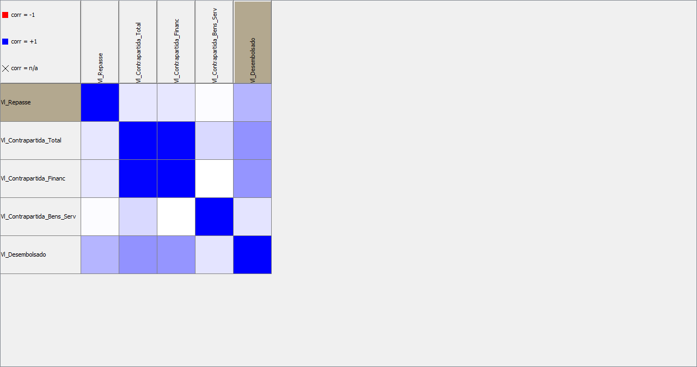
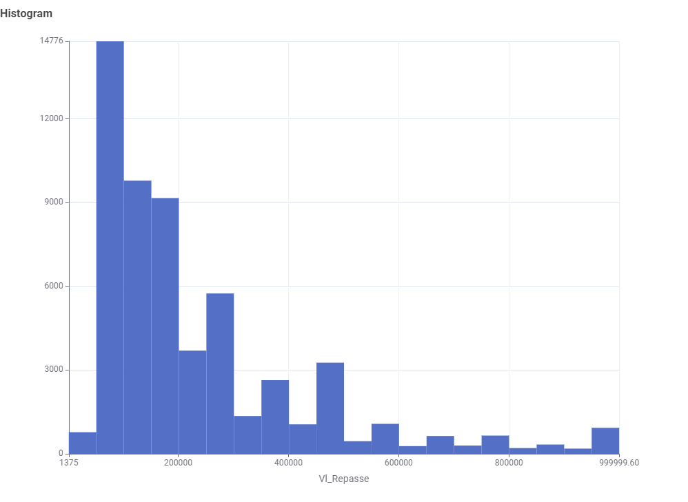

# 🕵️‍♀️ Auditoria de Dados Públicos: O Caso dos "Bilionários da Aftosa" no SICONV

> **Projeto de Conclusão da Disciplina:** Introdução à Ciência de Dados (Tratamento de Dados)
> **Ferramentas:** KNIME Analytics Platform, SQLite, Estatística Descritiva.

## 🎯 Sobre o Projeto
Este repositório documenta o processo de ETL (Extração, Transformação e Carga) e análise exploratória realizado sobre a base de dados do **SICONV (Sistema de Gestão de Convênios e Contratos de Repasse)**. 

O objetivo inicial era técnico (limpeza e correlação), mas a análise revelou inconsistências graves — verdadeiros "fantasmas" bilionários — que distorciam toda a estatística de repasses governamentais no Brasil.

---

## 🚨 O "Escândalo" dos Dados: 17,86 Bilhões que Não Existem

Durante a análise exploratória, identificamos outliers extremos que quebravam qualquer visualização gráfica. Ao investigar a fundo (Drill-down), encontramos um padrão de erro crasso que chamo de **"O Caso da Febre Aftosa"**:

* **O Achado:** 4 registros de convênios com valores exorbitantes somando **R$ 17.86 Bilhões**.
    * 2 registros de **R$ 7.668.441.608,96** (7,6 Bilhões).
    * 2 registros de **R$ 1.273.996.085,76** (1,2 Bilhão).
* **A Origem:** Todos destinados à "Erradicação da Febre Aftosa" no Mato Grosso do Sul (IAGRO), datados de **2011 a 2015**.
* **As Evidências de Erro (Lixo nos Dados):**
    1.  **Sequencialidade Suspeita:** Os registros possuem IDs sequenciais (49578 a 49581), sugerindo uma inserção em lote ("canetada" única ou erro de importação).
    2.  **Duplicidade Exata:** Os valores são idênticos até o centavo, o que é estatisticamente improvável para convênios diferentes, principalmente à esta destinação.
    3.  **Dados Faltantes:** Campos críticos como "Quantidade de Prorrogações" estavam vazios (`?`), algo inadmissível para contratos dessa magnitude.

**Conclusão da Auditoria:** Trata-se de "sujeira" estatística (provável erro de digitação manual do sistema legado) que, se não tratada, inviabiliza qualquer análise séria sobre o orçamento público.

---

## 📉 Desigualdade Social e a "Mentira" da Média

Antes da limpeza desses dados espúrios, o Histograma apresentava o que chamamos de **"Efeito Godzilla"**: uma única barra gigante contendo 99% dos dados espremidos, enquanto o eixo X se esticava para acomodar os 7 bilhões.

Ao removermos os outliers (filtrando repasses < R$ 1 Milhão), a verdadeira face da desigualdade nos repasses apareceu:

* **A Cauda Longa (Long Tail):** A realidade do Brasil não são obras bilionárias. A imensa maioria dos convênios se concentra na faixa de **R$ 100.000,00 a R$ 250.000,00**.
* **O "Varejo" da Política:** O gráfico revelou picos exatos em valores redondos (100k, 250k), indicando o padrão de Emendas Parlamentares e "Kits" padronizados para pequenas prefeituras.
* **Visualização:** O gráfico final prova que, para enxergar a realidade da "maioria pobre" (municípios pequenos), precisamos limpar a distorção causada pela "minoria rica" (ou, neste caso, pelos erros bilionários apresentados nos dados).

---

## 🛠️ O Processo Técnico (Pipeline KNIME)

O fluxo de trabalho (`.knwf`) disponível neste repositório realiza as seguintes etapas:

1.  **Ingestão:** Conexão com banco de dados `SQLite`.
2.  **Pré-processamento:** Tratamento de *Missing Values* e conversão de tipos.
3.  **Redução de Dimensionalidade:** Uso de **Matriz de Correlação** para identificar e remover variáveis redundantes (colunas que dizem a mesma coisa).
4.  **Filtragem de Outliers:** Aplicação de regras de negócio (`Row Filter`) para remover as inconsistências bilionárias detectadas e filtrar os resultados em gráficos mais condizentes com as desigualdades sociais.
5.  **Visualização:** Geração de Histogramas comparativos (Antes x Depois).

## 📊 Resultados Visuais

### 1. A Matriz de Correlação
*Análise técnica para eliminação de redundâncias.*

### 2. A Distribuição Real dos Repasses (Pós-Limpeza)
*O gráfico que revela a concentração de recursos na faixa de 100k-250k, após a remoção dos poucos contratos milionários e do "lixo" bilionário.*

---

> *Projeto desenvolvido por ** Fabiola Nunes Salgueiro**.*
> **A integridade dos dados reflete o respeito pelo dinheiro público. Dados sujos são portas abertas à ineficiência administrativa. Onde o olhar humano falha diante de milhões de linhas, a mineração de dados atua como um farol de verdade. Garantir a rigidez dessas informações não é apenas uma tarefa de TI, é um imperativo ético à proteção das contas públicas. Transparência sem qualidade de dados é apenas uma ilusão de ótica! Ao revelar inconsistências bilionárias, provamos que analisar dados é vital à cidadania: afinal, onde os olhos não veem, o algoritmo detecta e o erário público agradece.
>> *"Se você torturar os dados por tempo suficiente, eles confessarão."*
> — **Ronald Coase**, Nobel de Economia.
